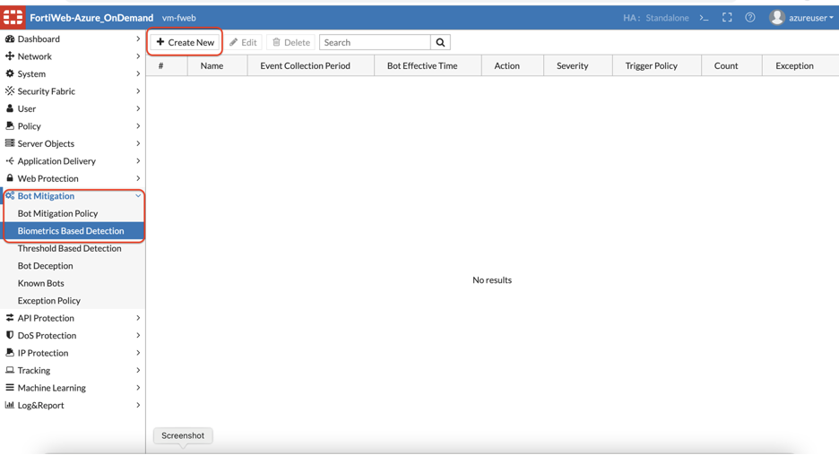
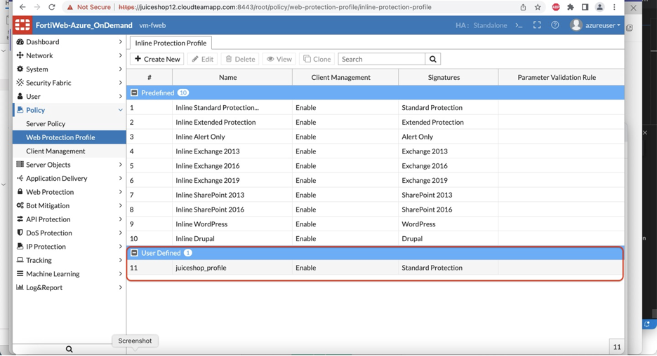
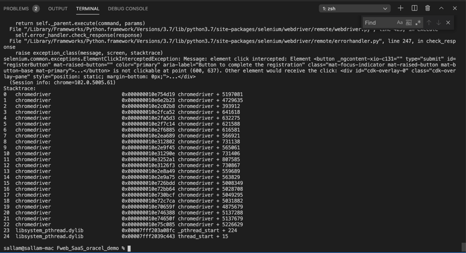

## [DEFENSE]

### Biometrics based bot detection:

Now let’s see how FortiWeb will protect the Juice shop from the Bot you ran during the attack module.

1) Create a Biometrics based Bot detection by clicking create new as shown below:

 

2. We can monitor for Various client events as shown below. However lets uncheck the default values and only select Screen Touch for now. 

​        Also change the event collection period to 10 seconds. Fortiweb will	             		monitor the client activities for 10 seconds before it confirms the client is 		a bot. 

​		Click OK.

3) Click Create New for the URL Fortiweb will monitor these events on. 

 

4) Select Regular expression, and **.\*** to match all the URL’s. 

​		Click OK.

5) Now Let’s create a Bot Mitigation Policy and attach the Bio metrics-based bot detection rule which we created in the earlier step. 

6) To apply this to the Juice Shop protection profile, Navigate to Policy >> Web protection profile >> click the juiceshop profile we create earlier. 

7. Scroll to Bot Mitigation and assign the policy we created in Step 5. 

​		Click OK.

8. Repeat the same steps from attack lab to run the bot again:

​		After 10 seconds the bot will crash with a crash log on the terminal. 

9. On Fortiweb if you go to Log >> log and report >> attack log: 

​		You should see an attack log generated for Biometrics based bot detection. 

 

10. Double click on the log to see a Message with the explanation.

That concludes the Biometrics based bot detection lab. 

