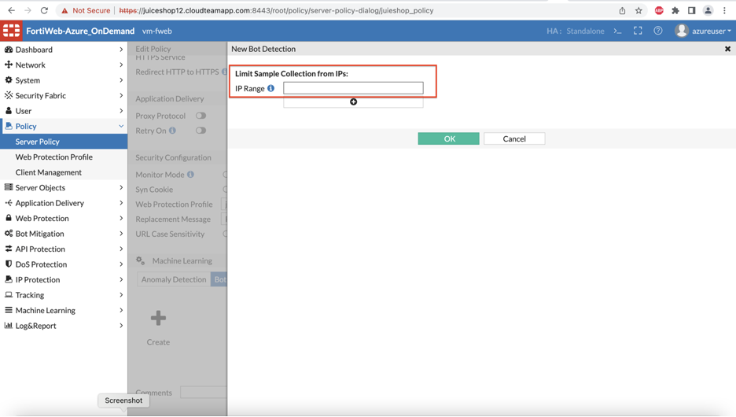
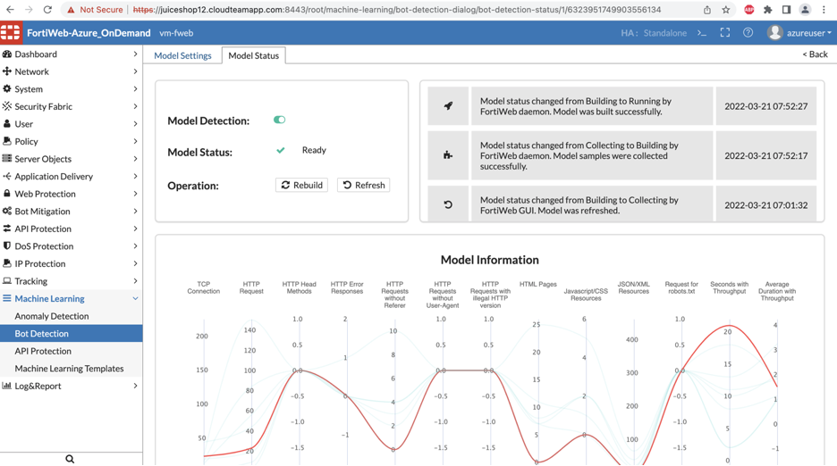
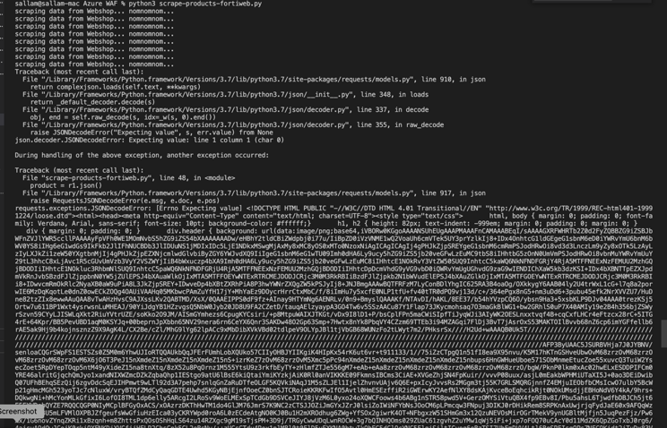

## [DEFENSE]

### Bot Detection - Machine Learning

1) Like the previous step to enable ML AD, it’s now time to enable to Bot Detection on Fortiweb. Double click on the Server policy and click create under Bot detection. 


2) You can leave blank for the IP range and click OK.



3) For the sake of time, a dat file is provided for you already. Import the dat file for Bot detection for the model to be running. 


 

4) Once the file is imported the model status should show ready. 



5. Run the Scrape_products.py script again. You can step away to get some coffee while this script is running :)

   ```
   python3 path/to/Scrape_products.py
   ```

   

6. By the time you will be back you should see the HTML for Fortiweb Block page. This can also be verified by going to Attack log. You should now be able to remember where the attack log is without my help ;) 



 


 

 

 

 

 

 

 

 

 