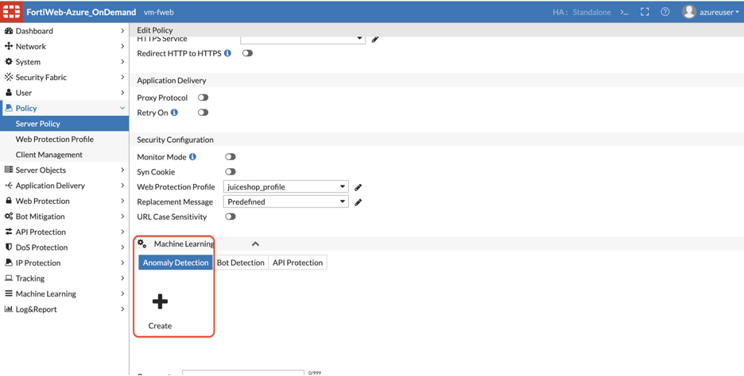
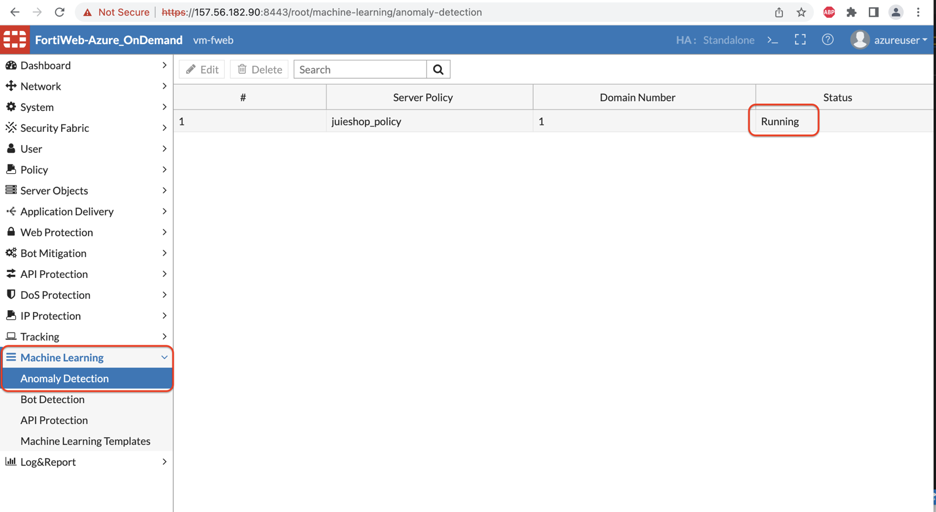
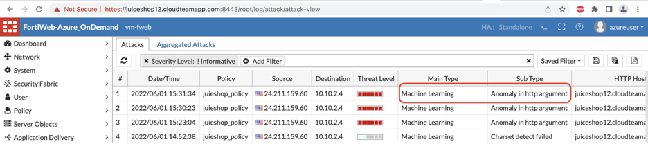

## **[DEFENSE]**

### Anomaly Detection


1) To configure Anomaly Detection, Go to Server Policy >> Double click the existing policy and scroll down to Machine Learning. 

​		Let’s start with AD ML. Click Create 

​	

2) You will need to enter the domain name here for the juiceshop. This domain name will be juiceshopX.cloudteamapp.com (X is the lab number assigned to you) 

​		Click OK.


3. Click on CLI to Configure the create ML policy and to change values for the Machine learning Anomaly Detection. 

   We are doing this since Fortiweb default values are set for 30 samples to 	be collected from single IP address within 30 minutes. As we only have one 	IP from which we can teach the model let’s use the commands below and re-write the existing values.

```
config waf machine-learning-policy
edit 1
set sample-limit-by-ip 5000
set svm-type extended
set ip-expire-cnts 1
set anomaly-detection-threshold 1
end
```

 

4) Once you enter the domain name from Step 2 and click OK you should be able to see the icons below. 

 

5) For the sake of the time for this lab the .dat file is provided to import the ML model.

Please import the dat file for Anomaly Detection. 

 

6) You should see the Fortiweb ML AD status to be running.



7) Double click on the above rule and click on View Domain data to view more information about the parameters Fortiweb already learned. 


 

8. Try the SQL lite attack by copy pasting the below URL in the browser or importing the cURL using POSTMAN or making cURL request. 

   ```
   http://juiceshopX.cloudteamapp.com:3000/rest/products/search?q='))-- 
   ```

   For example: 

   ```
   http://juiceshop12.cloudteamapp.com:3000/rest/products/search?q='))--
   ```

**To import on POSTMAN:**

```
curl --location --request GET 'http://juiceshop12.cloudteamapp.com:3000/rest/products/search?q='\''))--' \

--header 'Content-Type: application/x-www-form-urlencoded' \
```


9) Check the attack log in Log and Report >> attack log to make sure this attack is being blocked by ML AD on Fortiweb. 



 

This concludes the ML - Anomaly Detection Lab. 